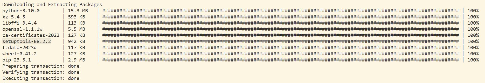
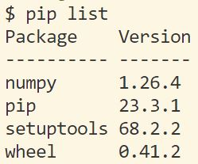
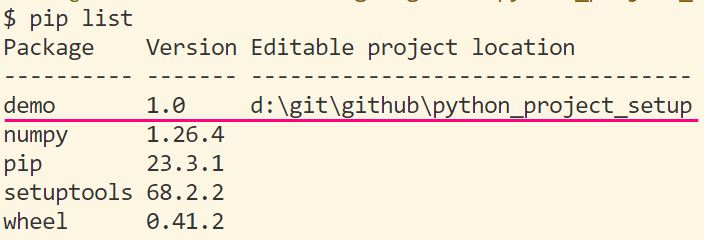
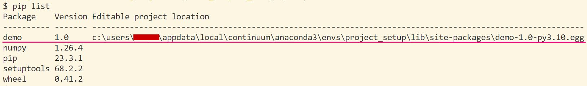
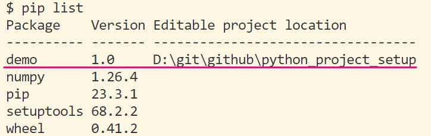

# python_project_setup

- This repository is a simple guideline of Python project setup.
- It will introduce the most common practice in setuping a development python package.
  1. [system path (`sys.path` / `PYTHONPATH`)](#31-system-path-syspath--pythonpath)
  2. [`setuptools` (`setup.py`)](#32-setuptools-setuppy)
  3. [`pyproject.toml`](#33-pyprojecttoml)

## 1. Virtual Environment setup (Windows Environment)
- Create a virtual environment (Python 3.10) for testing

```bash
conda create -y -n project_setup python==3.10
conda activate project_setup
pip install -r requirements.txt
```

- Remark
  - Only `numpy==1.26.4` is listed in `requirements.txt`and installed.
  - When creating new virtual environment, `setuptools` is installed by default, which will be introduced in **Section 3.2**



## 2. Background
- Python has numerous external open-source packages. 
  - The packages will be installed via `pip install <package>` or `conda install <package>`
  - And during Python project development, different external packages will be imported via `import <package>`
  - Example: [import_external_package.py](import_external_package.py)

```bash
pip install numpy==1.26.4
```

```python
import numpy
import numpy as np
from numpy import mean

# python import_external_package.py
# -----------------------------------
# Mean   of [1, 2, 4]: 2.33
# Median of [1, 2, 4]: 2.00
```

- However, if a Python project is in development phase like codes under `src/demo` folder, how to use the same `import` command to import the related variables/functions/classes.
  - Example: [import_internal_package.py](import_internal_package.py)

```
# Folder structure
├── src
│   ├── demo
│   │   ├── utils.py
└── import_internal_package.py
```

```python
from demo.utils import mean, median

# python import_internal_package.py
# ---------------------------------------------------------------------------------
# Traceback (most recent call last):
#   File "python_project_setup\import_internal_package.py", line 1, in <module>    
#     from demo.utils import mean, median
# ModuleNotFoundError: No module named 'demo'
```

- To tackle the above issue and smoothen the Python development flow, below are 3 popular methods to `import` the required packages correctly.
  1. System path (`sys.path` / `PYTHONPATH`)
  2. `setuptools` (`setup.py`)
  3. `pyproject.toml`

## 3.1. System path (`sys.path` / `PYTHONPATH`)
- Append the code folder path to system path so Python knows where to import the related variables.
- There are 2 methods to append the path.

### 3.1.1. By command line: `export PYTHONPATH="<code folder path>"`

```bash
export PYTHONPATH="./src"

echo $PYTHONPATH
# ./src

python import_internal_package.py
# Mean   of [1, 2, 4]: 2.33
# Median of [1, 2, 4]: 2.00
```

### 3.1.2. Edit the sys.path within the script (Example: [syspath_3.1.py](syspath_3.1.py))

```python
import sys
sys.path.append("<code folder path>")
```

```python
# Example: syspath_3.1.py
import sys
sys.path.append("./src")

from demo.utils import mean, median

# python syspath_3.1.py
# ------------------------------
# Mean   of [1, 2, 4]: 2.33
# Median of [1, 2, 4]: 2.00
```

## 3.2. `setuptools` (`setup.py`)
- The most standard Python package building and packaging library
  - [Reference](https://setuptools.pypa.io/en/latest/userguide/)
- Functionality
  1. **Package Management**: Define package metadata like name, version, license...
  2. **Package Discovery**: Discover and include Python packages required in the distribution
  3. **Dependency Management**: Specify dependencies to be installed for your package
  4. **Entry Point**: Define scripts / plugins that could be run in users' environment

- To enable this, `setuptools` should be installed and [`setup.py`](setup.py) is required.

```bash
# Install setuptools
pip install -U setuptools
```

```python
# setup.py
from setuptools import setup, find_packages

with open('README.md', 'r') as f:
    long_description = f.read()

setup(
    # Package Metadata
    name='demo',            # Package name (e.g. numpy) *
    version='1.0',          # Version number *
    author="thewwu",        # Author name
    author_email="",        # Author email
    license="",             # Package license (For open-source / commercial use)
    description="Demo package for project setup",           # 1-sentence summary
    long_description=long_description,                      # Detailed summary like README
    long_description_content_type="text/markdown",          # Format of long summary 
    url="https://github.com/thewwu/python_project_setup",   # URL

    # Package Discovery
    packages=find_packages(),   # Auto-discover required packages
    package_dir={'': 'src'},    # Mapping package names to directories *

    # Dependency Management
    python_requires=">=3.10",               # Python version requirement
    setup_requires="setuptools>=68.2.2",    # Package required before running setup.py
    install_requires=["numpy>=1.18.5"],     # Package required for this package *
    
    # Entry point
    entry_points={                          # Entry point for console
        'console_scripts': [
            'demo_run = demo.utils:run'
        ],
    },
)
```

#### 3.2.1. Development mode
- To install the internal packages and enable development mode, run the below line in git bash/command line

```bash
pip install -e .
# or
python setup.py develop
```

| Before | After |
| ----- | ----- |
|  |  |

```bash
# Now, the python interpret knows where to import demo package

python import_internal_package.py
# ------------------------------
# Mean   of [1, 2, 4]: 2.33
# Median of [1, 2, 4]: 2.00

# Run console script
demo_run
# ------------------------------
# Mean   of [1, 2, 4]: 2.33
# Median of [1, 2, 4]: 2.00
```

#### 3.2.2. Other popular functions for setup.py

- Install the internal package in **static way**, not editable until next installation
  - Purpose: Freeze the codebase like `pip install demo`
  - CMD: `python setup.py install` or `pip install .`
  - Remark: A empty-content script `__init__.py` is required for the folder needed.
    - e.g. `src/demo/__init__.py`
  - 

- Create the source distribution (tar, zip, whl) to share the package with others
  - Purpose: Install the package by others with shared tar/zip/whl files
  - CMD: `python setup.py sdist` or `python setup.py bdist_wheel`
  - After running the above command, the packaged library is available in `sdist/{name}-{version}.tar.gz` or `dist/{name}-{version}-py3-none-any.whl`
    - e.g. `sdist/demo-1.0.tar.gz`, `dist/demo-1.0-py3-none-any.whl`

- To install the package via the package distribution
  - CMD: `pip install sdist/{name}-{version}.tar.gz` or `pip install dist/{name}-{version}-py3-none-any.whl`
  - Example: `pip install dist/demo-1.0.tar.gz`

- Other functions in [Official website](https://setuptools.pypa.io/en/latest/userguide/)

## 3.3. `pyproject.toml`
- Recent popular Python management system introduced in PEP518
  - [PEP: Python Enhancement Proposal](https://peps.python.org/pep-0000/), design document providing info to Python community or introducing new feature 
  - `pyproject.toml` is the **configuration file defining build system requirements** for Python projects
    - Written in TOML (Tom's Obvious, Minimal Language) format

- Now, pyproject.toml supports various packaging building backend.
  1. [Hatchling](https://hatch.pypa.io/latest/)
  2. [Flit-core](https://flit.pypa.io/en/stable/)
  3. [PDM-backend](https://pdm-project.org/latest/)
  4. [Setuptools](https://setuptools.pypa.io/en/latest/)

- Different build system **serves similar functions** of Python package management. 
  - Each of them has its strength and drawbacks and with its setup requirement.
  - In this guideline, **`setuptools` will be focused** on for the comparison with [Section 3.2](#32-setuptools-setuppy).

#### 3.3.1. `pyproject.toml`
- Define the build backend as `setuptools`
- Include the package details like metadata, urls
- [Reference](https://packaging.python.org/en/latest/guides/writing-pyproject-toml/) 

```
[build-system]
requires = ["setuptools"]
build-backend = "setuptools.build_meta"

[project]
name = "demo"
version = "1.0"
authors = [
    {name = "thewwu"}
]
license = {text = ""}
description = "Demo package for project setup"
readme  = "README.md"
requires-python = ">=3.10"
dependencies = [
    "numpy >= 1.18.5"
]

[project.urls]
Repository = "https://github.com/thewwu/python_project_setup"

[tool.setuptools.packages.find]
where = ["src"]

[project.scripts]
demo_run = "demo.utils:run"
```

#### 3.3.2. Development mode
- Similar to Section 3.2, execute below command to enable development mode
  - CMD: `pip install -e .`

| Before | After |
| ----- | ----- |
|  |  |

```bash
# Now, the python interpret knows where to import demo package

python import_internal_package.py
# ------------------------------
# Mean   of [1, 2, 4]: 2.33
# Median of [1, 2, 4]: 2.00

# Run console script
demo_run
# ------------------------------
# Mean   of [1, 2, 4]: 2.33
# Median of [1, 2, 4]: 2.00
```

#### 3.3.3. Other functions
- Same as [Section 3.2.](#322-other-popular-functions-for-setuppy)

- Install the internal package in **static way**, not editable until next installation
  - Purpose: Freeze the codebase like `pip install demo`
  - CMD: `python setup.py install` or `pip install .`
  - Remark: A empty-content script `__init__.py` is required for the folder needed.
    - e.g. `src/demo/__init__.py`

- Create the source distribution (tar, zip, whl) to share the package with others
  - Purpose: Install the package by others with shared tar/zip/whl files
  - CMD: `python -m build`
  - After running the above command, the packaged library is available in `dist/{name}-{version}.tar.gz` or `dist/{name}-{version}-py3-none-any.whl`
    - e.g. `dist/demo-1.0.tar.gz`, `dist/demo-1.0-py3-none-any.whl`

- To install the package via the package distribution
  - CMD: `pip install dist/{name}-{version}.tar.gz` or `pip install dist/{name}-{version}-py3-none-any.whl`
  - Example: `pip install dist/demo-1.0.tar.gz`
